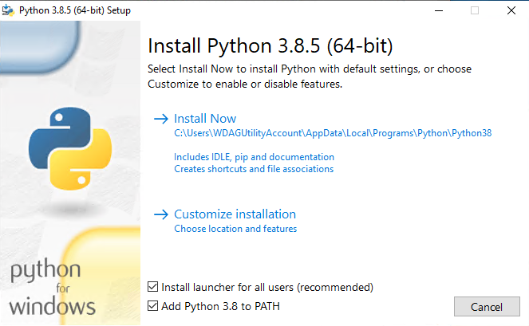

# Chatbot der Angewandten Informatik - Installationsanweisungen BzA

Diese Installationsanweisungen sollen den Kunden befähigen, die bereitgestellte Software zur Abnahme einzurichten. 
Es ist zu beachten, dass diese Anleitung **_nicht_** die notwendigen Schritte zur Installation und Inbetriebnahme auf
einem Livesystem bzw. Server beschreibt, da dies zusätzliche Schritte in Abhängigkeit des verwendeten Systems erfordern würde. 

## Schritt 1: Vorraussetzungen

Zur Inbetriebnahme müssen die folgenden Softwarekomponenten auf dem Testsystem installiert sein:
- git
- python 3.8.5 64-bit
- pipenv 
- Microsoft Visual C++ Redistributable

#### git
Da im späteren Verlauf das Git-Repository der Software geklont werden muss, 
ist es notwendig, _**git**_ auf dem Testsystem zu installieren.

Um zu Überprüfen, ob _**git**_ auf Ihrem Sytem installiert ist, kann folgender Befehl in der Kommandozeile ausgeführt 
werden: `git --version`

Wird daraufhin die Version angezeigt, ist _**git**_ installiert. Sollte der Befehl nicht gefunden werden, kann _**git**_ 
unter folgendem Weblink für das entsprechende System bezogen und installiert werden:
https://git-scm.com/downloads

#### python
Der Chatbot benötigt eine aktuelle (**_3.8.5+_**), _**64-bit**_ Version von _**python**_, die auf dem Testsystem 
installiert ist.

Diese Version von _**python**_ kann auf unter der folgenden Webadresse bezogen und installiert werden: 
https://www.python.org/downloads/release/python-385/

Bitte wählen Sie die passende Version für das Betriebssystem des Testgerätes und achten Sie dabei darauf, die entsprechende **_64-bit_** Version
herunterzuladen.

Achten Sie bei der Installation darauf, die Option _**"Add Python 3.8 to PATH"**_ anzuwählen wie in folgendem Screenshot dargestellt:



Zur Verifizierung der korrekten Installation, nutzen Sie bitte folgenden Befehl in der Kommandozeile: `py -3 -V`

#### pipenv

_**pipenv**_ ist ein spezieller Paketmanager für _**python**_ der dafür benutzt wird, die Abhängigkeiten des Projekts 
in einer virtuellen Umgebung zur Verfügung zu stellen.
Eine Installation erfolgt über den in der _**python**_ Installation enthaltenen Paketmanager _**pip**_.

Zur Installation von pipenv muss folgender Befehl in der Kommandozeile ausgeführt werden: `pip install --user pipenv`
 
#### Microsoft Visual C++ Redistributable

Das **_Microsoft Visual C++ Redistributable_** Package sollte in den meisten Fällen bereits auf dem System vorhanden sein. 
Ist dies dennoch nicht der Fall, kommt es in **Schritt Nr.3** bei der Ausführung des letzten Befehls zu einem Fehler:

```
ImportError: DLL load failed while importing nn_parser: Das angegebene Modul wurde nicht gefunden.
```

In diesem Fall laden Sie bitte das erforderliche Paket, unter der folgenden Webadresse herunter und installieren es: 
https://support.microsoft.com/de-de/help/2977003/the-latest-supported-visual-c-downloads

Anschließend kann der letzte Befehl in Schritt _**Nr.3**_ wiederholt werden und anschließend, wie weiter beschrieben, verfahren 
werden.

#### Hinweis
Nach der Installation einer oder mehrerer oben aufgeführten Komponenten kann es notwendig sein, das System neu zu starten, 
um die Installation abzuschließen und diese auf dem System verfügbar zu machen. 

## Schritt 2: Klonen des Repositories

Als Nächstes müssen die Dateien des Chatbots von dem bereitgestellten Git-Repository auf das Testystem kopiert werden.

Dieses Repository wird auf dem Server der Fachhochschule Erfurt bereitgestellt und ist unter folgendem Adresse erreichbar:
https://source.ai.fh-erfurt.de/Yggdrasil/fhe_chatbot.git

Zunächst muss eine Kommandozeile in dem Ordner geöffnet werden, in welchen die Projektdaten abgelegt werden sollen. 
Anschließend kann mit folgendem Kommandozeilebefehl das Repository geklont werden: 

`git clone https://source.ai.fh-erfurt.de/Yggdrasil/fhe_chatbot.git ./`

Während des Prozesses ist die Eingabe des **Benutzernamens** und **Passworts** des **Benutzeraccounts (Shibboleth)** 
der Fachhochschule Erfurt erforderlich.

## Schritt 3: Installation der Abhängigkeiten

Ist das Repository kopiert, muss in der Kommandozeile folgender Befehl ausgeführt werden: `python -m pipenv install`

Daraufhin werden von _**pipenv**_ alle Abhängigkeiten installiert und ein neues **Virtual Environment** 
aufgesetzt, in welchem der Chatbot ausgeführt werden kann.

Ist dies erfolgreich geschehen, müssen innerhalb dieses Environments noch zwei weitere Befehle ausgeführt werden, 
um erforderlichen Ressourcen für die _**python**_ Pakete **_nltk_** und _**spacy**_ herunterzuladen.

Dazu sind nacheinander die folgenden Befehle auszuführen:

`python -m pipenv run python -m nltk.downloader all`

`python -m pipenv run python -m spacy download de_core_news_md`

## Schritt 4: Starten des Entwicklungsservers

Der nächste Schritt stellt das Starten des Entwicklungsservers dar. Dazu muss der Befehl 
`python -m pipenv run manage.py runserver` ausgeführt werden. Daraufhin sollte eine Meldung wie diese in der 
Kommandozeile erscheinen:

``` 
Performing system checks...

Watching for file changes with StatReloader
System check identified no issues (0 silenced).
October 1, 2020 - 00:00:00
Django version 3.1, using settings 'fhe_chatbot.settings'
Starting development server at http://127.0.0.1:8000/
Quit the server with CTRL-BREAK.
```

Dies quittiert den Erfolg der Einrichtung und macht die Software auf dem System, unter der lokalen Adresse 
http://127.0.0.1:8000/ verfügbar.

Solange der Chatbot verfügbar bleiben soll, **muss das entsprechende Kommandozeilenfenster geöffnet bleiben**. Um den Server 
zu Stoppen benutzen Sie bitte das Tastenkürzel `Strg-C`.

Jeder erneute Start des Servers erfordert daraufhin nur die Berücksichtigung der Punkte **_4 & 5_**.

## Schritt 5: Zugriff auf den Chatbot

#### Adminpanel
Das Adminpanel ist unter der lokalen Adresse http://127.0.0.1:8000/adminpanel/ zu erreichen.
Das Panel erfordert eine Authentifizierung, die in dieser Testumgebung den Benutzernamen `admin` und das Passwort 
`admin` fordert.

#### Chatbot Frontend
Das Frontend des Chatbots ist über die mitgelieferte IFrame-Komponente zu erreichen. Dies wurde für Testzwecke bereits 
in dem Webdokument `index.html` übernommen, welches im **Root-Pfad** des **geklonten Repositories** zu finden ist. Diese Datei 
muss in einem Webbrowser geöffnet werden, was bei den meisten Systemen durch einen einfachen Doppelklick zu erreichen 
ist.

Alternativ kann der Chatbot direkt über die Adresse http://127.0.0.1:8000/chatbot/ erreicht werden.